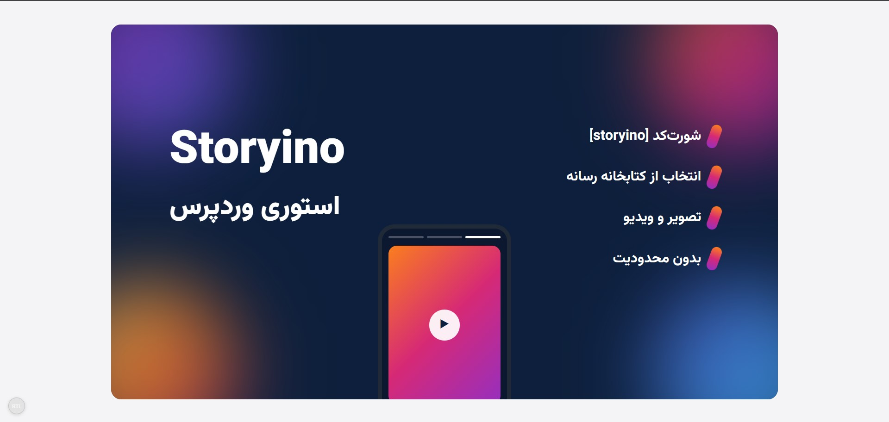

<div align="center">
<h1>Storyino</h1>
<p>پلاگین وردپرس برای نمایش استوری تصویر و ویدیو به صورت مینیمال، با شورت‌کد و انتخاب مستقیم از کتابخانه رسانه وردپرس.
</p></div>



---

## امکانات

- نمایش استوری تصویر و ویدیو
- طراحی مینیمال و موبایل‌پسند
- شورت‌کد ساده `[storyino]`
- ساخت دکمه استوری
- انتخاب مستقیم تصویر/ویدیو از Media Library
- انتخاب نامحدود آیتم
- مرتب‌سازی با Drag & Drop
- پخش ویدیو به صورت muted
- نوار پیشرفت استوری
- امکان شبیه‌سازی سرعت دانلود برای تست

---

## نصب

### روش 1: آپلود دستی

پوشه پلاگین را داخل مسیر زیر قرار بده:

```txt
wp-content/plugins/
```

ساختار نهایی باید این شکلی باشد:

```txt
wp-content/plugins/storyino/
```

سپس پلاگین را از پیشخوان وردپرس فعال کن.

---

### روش 2: زیپ کردن

پوشه `storyino` را zip کن.

سپس از مسیر زیر آپلود کن:

```txt
پیشخوان > افزونه‌ها > افزودن > بارگذاری افزونه
```

بعد فعال کن.

---

## استفاده سریع

1. پلاگین را فعال کن.

2. از پیشخوان وارد منوی زیر شو:

```txt
Storyino
```

3. روی دکمه زیر بزن:

```txt
+ انتخاب از کتابخانه رسانه
```

4. چند تصویر یا ویدیو انتخاب کن.

5. ترتیب آن‌ها را با درگ تنظیم کن.

6. روی **ذخیره تغییرات** بزن.

7. داخل هر برگه یا نوشته، شورت‌کد زیر را قرار بده:

```txt
[storyino]
```

---

## شورت‌کد

### شورت‌کد ساده

```txt
[storyino]
```

خروجی یک دکمه است. با کلیک روی دکمه، استوری‌ها باز می‌شوند.

---

## پارامترها

| پارامتر    | توضیح                                | مقدار پیش‌فرض |
| ---------- | ------------------------------------ | ------------- |
| `label`    | متن دکمه                             | مشاهده استوری |
| `ids`      | آی‌دی فایل‌های رسانه با کاما جدا شده | خالی          |
| `speed`    | شبیه‌سازی سرعت دانلود بر حسب KB/s    | 250           |
| `duration` | مدت نمایش هر تصویر بر حسب میلی‌ثانیه | 5000          |

---

## مثال‌ها

### تغییر متن دکمه

```txt
[storyino label="مشاهده استوری‌ها"]
```

---

### غیرفعال کردن شبیه‌سازی سرعت دانلود

```txt
[storyino speed="0"]
```

---

### تنظیم مدت نمایش هر عکس

```txt
[storyino duration="6000"]
```

---

### استفاده از آی‌دی‌های خاص رسانه

```txt
[storyino ids="12,18,25"]
```

در این حالت، فقط آی‌دی‌های واردشده نمایش داده می‌شوند و لیست تنظیمات نادیده گرفته می‌شود.

---

## انتخاب رسانه

در صفحه تنظیمات Storyino می‌توانی:

- تصویر انتخاب کنی
- ویدیو انتخاب کنی
- تعداد نامحدود آیتم انتخاب کنی
- آیتم‌ها را حذف کنی
- ترتیب آیتم‌ها را با درگ عوض کنی

---

## ساختار فایل‌ها

```txt
storyino/
├── storyino.php
├── README.md
├── GUIDE.md
├── uninstall.php
│
├── includes/
│   ├── shortcode.php
│   ├── admin.php
│   └── helpers.php
│
└── assets/
    ├── css/
    │   ├── storyino.css
    │   └── storyino-admin.css
    │
    ├── js/
    │   ├── storyino.js
    │   └── storyino-admin.js
    │
    └── media/
        ├── 1.jpg
        ├── 2.jpg
        ├── 3.mp4
        ├── 4.jpg
        └── 5.mp4
```

---

## نکات مهم

- ویدیوها برای پخش خودکار به صورت بی‌صدا پخش می‌شوند.
- بهترین فرمت ویدیو:

```txt
MP4 / H.264
```

- برای محیط واقعی بهتر است شبیه‌سازی سرعت را غیرفعال کنی:

```txt
[storyino speed="0"]
```

- اگر فایل‌ها داخل `assets/media` هستند و بعداً پلاگین آپدیت می‌شود، بهتر است فایل‌های اصلی داخل `wp-content/uploads` باشند تا با آپدیت پلاگین پاک نشوند.

---

## رفع مشکلات سریع

### دکمه نمایش داده نمی‌شود

- پلاگین فعال است؟
- شورت‌کد داخل محتوا هست؟
- قالب `wp_footer()` دارد؟

---

### استوری خطا می‌دهد

- فایل رسانه آپلود شده است؟
- فایل 404 نشده است؟
- لینک فایل با HTTP/HTTPS سایت سازگار است؟

---

### ویدیو پخش نمی‌شود

- فرمت ویدیو MP4 باشد.
- ویدیو muted است؛ مرورگرها autoplay با صدا را محدود می‌کنند.
- کنسول مرورگر را بررسی کن.

---

## لایسنس

GPL-2.0-or-later
