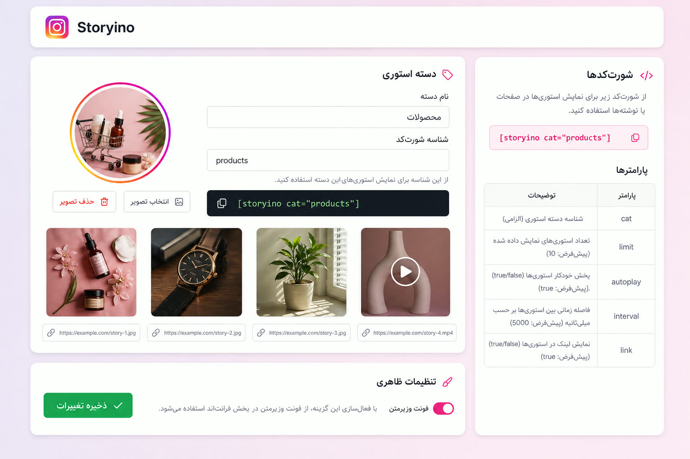
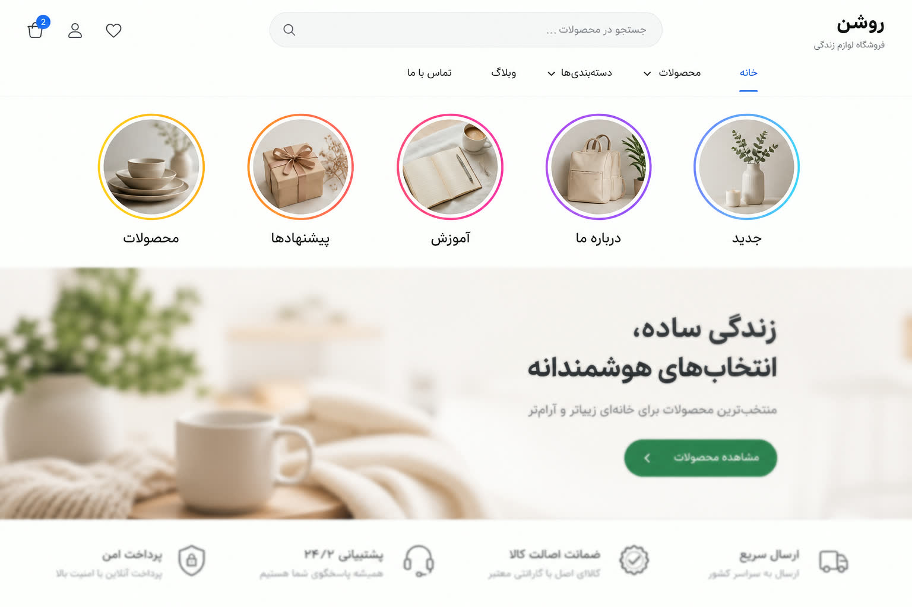
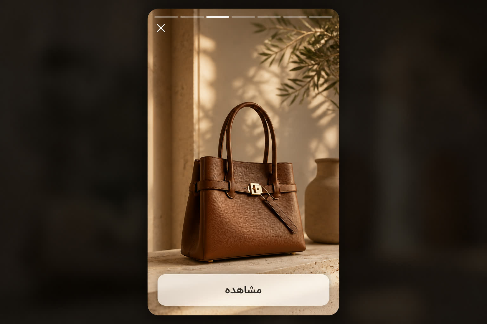

<div align="center">

# Storyino

پلاگین وردپرس برای نمایش استوری تصویر و ویدیو، شبیه اینستاگرام، با دسته‌بندی، شورت‌کد و انتخاب مستقیم از کتابخانه رسانه.

**نسخه فعلی: 1.1.6** · وردپرس ۶.۳+ · PHP ۷.۴+

[نصب](#نصب) · [شورت‌کد](#شورتکد) · [تنظیمات](#تنظیمات-پیشخوان) · [توسعه](#توسعه) · [راهنمای کامل](./GUIDE.md)

</div>


---

## معرفی

Storyino استوری‌های تصویر و ویدیو را به‌صورت حلقه‌های افقی (مثل اینستاگرام) نشان می‌دهد. هر دسته یک دایره با تصویر کاور و شورت‌کد اختصاصی دارد. با کلیک روی دایره، پلیر تمام‌صفحه باز می‌شود.

CSS، JS و فونت وزیرمتن همگی داخل خود پلاگین هستند و **از CDN لود نمی‌شوند**.

---

## امکانات

- دسته‌بندی استوری با تصویر دایره و شورت‌کد اختصاصی
- شورت‌کد `[storyino]` برای همه دسته‌ها و `[storyino cat="slug"]` برای یک دسته
- انتخاب تصویر و ویدیو از کتابخانه رسانه وردپرس
- لینک مقصد جداگانه برای هر آیتم (دکمه پایین استوری)
- مرتب‌سازی دسته‌ها و آیتم‌ها با کشیدن و رها کردن
- پیش‌نمایش فریم ویدیو در پنل ادمین
- بستن خودکار پلیر بعد از آخرین استوری
- دانلود رسانه با سرعت اینترنت کاربر (بدون محدودیت مصنوعی)
- پیش‌بارگذاری استوری بعدی
- فونت عنوان دایره و دکمه لینک: پیش‌فرض فونت قالب، اختیاری وزیرمتن محلی
- ظاهر دکمه متنی یا آیکونی (برای حالت بدون دسته / دکمه قدیمی)
- بدون وابستگی به CDN برای استایل و فونت

---

## نمای داشبورد



---

## نمای فرانت



---

## نصب

### روش ۱: پوشه پلاگین

پوشه را در این مسیر بگذار:

```txt
wp-content/plugins/storyino/
```

سپس از پیشخوان وردپرس پلاگین را فعال کن.

### روش ۲: فایل زیپ

پوشه `storyino` را زیپ کن و از مسیر زیر آپلود کن:

```txt
پیشخوان > افزونه‌ها > افزودن > بارگذاری افزونه
```

بعد فعال کن.

برای زیپ نهایی این موارد لازم نیست و بهتر است حذف شوند: `node_modules/` ، `graphify-out/` ، `src/` ، `build.js` ، `package.json` ، `package-lock.json` و تصاویر README. پلاگین فقط با `storyino.php` ، `uninstall.php` ، `includes/` و `assets/` کار می‌کند.

---

## استفاده سریع

1. پلاگین را فعال کن.
2. از منوی **Storyino** در پیشخوان وارد تنظیمات شو.
3. یک دسته بساز، نام و شناسه شورت‌کد را بنویس.
4. تصویر دایره استوری را انتخاب کن (اگر اولین آیتم ویدیو باشد، کاور الزامی است).
5. از کتابخانه رسانه تصویر یا ویدیو اضافه کن و ترتیب را با درگ تنظیم کن.
6. در صورت نیاز برای هر آیتم لینک مقصد بگذار.
7. **ذخیره تغییرات** را بزن.
8. شورت‌کد را در برگه، نوشته، المنتور یا ویجت Shortcode قرار بده.

```txt
[storyino]
```

---

## شورت‌کد

### همه دسته‌ها

```txt
[storyino]
```

لیست افقی همه دسته‌ها را مثل استوری اینستاگرام نشان می‌دهد.

### یک دسته

```txt
[storyino cat="products"]
```

فقط همان دسته را نشان می‌دهد. بعد از ذخیره، هر دسته شورت‌کد اختصاصی هم می‌گیرد، مثلاً:

```txt
[storyino-products]
```

شناسه باید انگلیسی، عدد و خط تیره باشد (`products` ، `cat-2`).

### آی‌دی رسانه به‌صورت دستی

```txt
[storyino ids="12,18,25"]
```

فقط همین فایل‌ها پخش می‌شوند و لیست دسته‌ها نادیده گرفته می‌شود.

### پارامترها

| پارامتر | توضیح | پیش‌فرض |
| --- | --- | --- |
| `cat` | شناسه دسته | خالی (همه دسته‌ها) |
| `ids` | آی‌دی فایل‌های رسانه، جداشده با کاما | خالی |
| `label` | عنوان روی دایره / دکمه | عنوان دسته یا «استوری» |
| `speed` | شبیه‌سازی سرعت دانلود بر حسب KB/s ؛ صفر یعنی سرعت واقعی کاربر | `0` |
| `duration` | مدت نمایش هر عکس به میلی‌ثانیه | `5000` |

### مثال‌ها

```txt
[storyino cat="offers" duration="6000"]
[storyino ids="12,18,25" label="پیشنهادها"]
[storyino speed="250"]
```

`speed` فقط برای دموست. در سایت واقعی همان پیش‌فرض صفر را بگذار.

اگر از صفحه‌ساز (مثل المنتور) استفاده می‌کنی، شورت‌کد را داخل ویجت Shortcode یا HTML بگذار.

---

## تنظیمات پیشخوان

مسیر: **Storyino**

### هر دسته

- تصویر دایره استوری (کاور)
- نام دسته
- شناسه شورت‌کد
- لیست تصویر / ویدیو
- لینک مقصد برای هر آیتم

اگر اولین آیتم دسته ویدیو باشد و کاور خالی باشد، ذخیره انجام نمی‌شود تا تصویر دایره انتخاب شود.

### تنظیمات ظاهری

- **متن دکمه لینک استوری:** متن دکمه پایین پلیر (مثلاً مشاهده، خرید)
- **ظاهر دکمه استوری:** متنی یا آیکونی
- **انیمیشن چرخش آیکون:** فقط برای حالت آیکونی
- **فونت وزیرمتن برای عنوان دایره و دکمه لینک:** اگر خاموش باشد، عنوان دایره (`.storyino-ring-label`) و دکمه لینک داخل پلیر (`.storyino-link-btn`) فونت قالب را می‌گیرند. اگر روشن باشد، همان دو بخش از فایل محلی `assets/fonts/Vazirmatn-Medium.woff2` استفاده می‌کنند؛ فونت با آدرس خود پلاگین لود می‌شود و به CDN وابسته نیست.

---

## رفتار پلیر



- استوری‌ها به‌ترتیب دسته پخش می‌شوند.
- ویدیو بی‌صدا (`muted`) پخش می‌شود تا مرورگر اجازه autoplay بدهد.
- با تمام شدن آخرین استوری، پلیر بسته می‌شود و از اول تکرار نمی‌شود.
- دکمه بستن، کلید Escape و کلیک روی پس‌زمینه هم پلیر را می‌بندند.
- استوری بعدی در پس‌زمینه از قبل لود می‌شود.
- لینک هر آیتم فقط `http` و `https` قبول می‌شود.

---

## فایل‌های محلی (بدون CDN)

در فرانت و ادمین هیچ استایل، اسکریپت یا فونتی از CDN، Google Fonts یا jsDelivr لود نمی‌شود.

| منبع | مسیر محلی |
| --- | --- |
| استایل فرانت | `assets/css/storyino.min.css` |
| اسکریپت فرانت | `assets/js/storyino.min.js` |
| استایل ادمین | `assets/css/storyino-admin.min.css` |
| اسکریپت ادمین | `assets/js/storyino-admin.min.js` |
| فونت وزیرمتن | `assets/fonts/Vazirmatn-Medium.woff2` |

فونت وزیرمتن فقط وقتی گزینه مربوط در تنظیمات روشن باشد روی عنوان دایره و دکمه لینک اعمال می‌شود. آدرس فایل فونت به‌صورت مطلق از خود پلاگین تزریق می‌شود تا با کش/ترکیب CSS قالب به‌هم نریزد.

ادمین فقط از jQuery و Media Library خود وردپرس استفاده می‌کند. Tailwind فقط در زمان بیلد به CSS نهایی تبدیل می‌شود و روی سایت کاربر از npm یا CDN لود نمی‌گردد.

---

## ساختار فایل‌ها

```txt
storyino/
├── storyino.php                    # فایل اصلی پلاگین، ثبت هوک و لود اسکریپت‌ها
├── uninstall.php                   # پاک کردن گزینه‌ها هنگام حذف پلاگین
├── build.js                        # اسکریپت بیلد (esbuild + PostCSS + CleanCSS)
├── package.json
├── README.md
├── GUIDE.md                        # راهنمای کاربردی فارسی
├── .gitignore
├── includes/
│   ├── admin.php                   # صفحه تنظیمات پیشخوان
│   ├── helpers.php                 # گزینه‌ها، سنیتایز و کش
│   └── shortcode.php               # رندر شورت‌کد و پلیر
├── src/                            # سورس (ورودی بیلد)
│   ├── css/
│   │   ├── storyino.css
│   │   └── storyino-admin.css      # Tailwind 4
│   └── js/
│       ├── storyino.js
│       └── storyino-admin.js
└── assets/                         # خروجی بیلد + فایل‌های ثابت
    ├── css/
    │   ├── storyino.min.css
    │   ├── storyino-admin.css      # نسخه غیر فشرده برای SCRIPT_DEBUG
    │   └── storyino-admin.min.css
    ├── js/
    │   ├── storyino.min.js
    │   └── storyino-admin.min.js
    ├── fonts/
    │   └── Vazirmatn-Medium.woff2
    └── media/                      # استوری پیش‌فرض اختیاری
```

فایل‌های داخل `src/` سورس هستند. خروجی آماده برای وردپرس در `assets/` ساخته می‌شود.

پوشه `assets/` با اینکه خروجی بیلد است در گیت نگه داشته می‌شود، چون وردپرس مستقیم از همان فایل‌ها می‌خواند و کاربر نهایی `npm install` نمی‌زند.

---

## توسعه

برای تغییر CSS/JS:

```bash
npm install
npm run build
```

حالت واچ:

```bash
npm run watch
```

پاک کردن خروجی بیلد:

```bash
npm run clean
```

اگر `SCRIPT_DEBUG` در وردپرس روشن باشد، نسخه غیر فشرده ادمین (`storyino-admin.css`) لود می‌شود. فرانت در حالت عادی از فایل‌های `.min` استفاده می‌کند.

بعد از هر تغییر در `src/` حتماً `npm run build` را بزن و خروجی `assets/` را هم کامیت کن، وگرنه تغییر روی سایت دیده نمی‌شود.

### چه چیزی در گیت نیست

`.gitignore` این موارد را نادیده می‌گیرد:

| مورد | دلیل |
| --- | --- |
| `node_modules/` | با `npm install` ساخته می‌شود |
| `graphify-out/` | خروجی و کش ابزار تحلیل کد |
| `*.log` | لاگ‌های موقت npm و ابزارها |
| `*.zip` ، `dist/` | خروجی بسته‌بندی برای آپلود به وردپرس |
| `.idea/` ، `.vscode/` | تنظیمات شخصی ویرایشگر |
| `.DS_Store` ، `Thumbs.db` | فایل‌های سیستم‌عامل |
| `.env` | مقادیر محلی و محرمانه |

---

## نکات

- بهترین فرمت ویدیو: **MP4 / H.264**
- کاور دایره بهتر است مربع باشد؛ نمایش با اندازه بندانگشتی وردپرس است.
- رسانه را در کتابخانه وردپرس نگه دار تا با به‌روزرسانی پلاگین پاک نشود.
- پوشه `assets/media` فقط برای نمونه است و برای سایت واقعی لازم نیست.

---

## رفع مشکل

**دایره‌ها دیده نمی‌شوند**

- پلاگین فعال است؟
- شورت‌کد درست در محتواست؟
- دسته ذخیره شده و حداقل یک تصویر/ویدیو دارد؟
- قالب تابع `wp_footer()` دارد؟

**استوری خطا می‌دهد**

- فایل در کتابخانه رسانه موجود است و ۴۰۴ نیست؟
- آدرس سایت و فایل هر دو http یا هر دو https هستند؟

**ویدیو پخش نمی‌شود**

- فرمت MP4 باشد.
- ویدیو عمداً بی‌صداست؛ مرورگر autoplay با صدا را محدود می‌کند.

**فونت عنوان دایره یا دکمه لینک عوض نمی‌شود**

- گزینه **فونت وزیرمتن برای عنوان دایره و دکمه لینک** را روشن کن و ذخیره بزن.
- صفحه سایت را سخت‌رفرش کن (`Ctrl+F5`) و کش قالب / کش افزونه را خالی کن.
- در HTML باید کلاس `storyino-use-vazir` روی `.storyino-tray` باشد.
- دکمه لینک فقط داخل پلیر است؛ بعد از باز کردن استوری بررسی‌اش کن.

---

## حذف پلاگین

با حذف از پیشخوان وردپرس، این گزینه‌ها پاک می‌شوند:

- دسته‌بندی‌ها و لیست استوری‌ها
- لینک آیتم‌ها
- متن دکمه لینک و تنظیمات ظاهری

فایل‌های آپلودشده در کتابخانه رسانه وردپرس باقی می‌مانند.

---

## لایسنس

GPL-2.0-or-later

مولف: [AmirrezaHeydari](https://github.com/Amirrezaheydari81)
